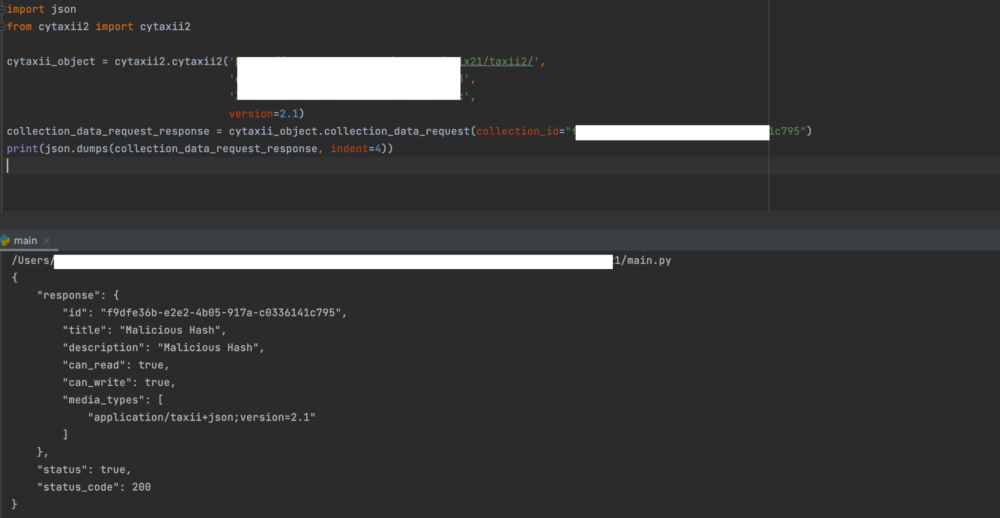

# Cyware’s CyTaxii2

## Introduction

**CYTAXII2** is an **Open Source** offering from **Cyware** that provides developers with the support for interacting with the TAXII server. 

CYTAXII2 acts as a TAXII client that you can install as a Python [pip] Library 

Cyware’s other open-source offerings also include Cyware Threat Intelligence Feeds that bring you valuable threat data from a wide range of open and trusted sources to deliver a consolidated stream of valuable and actionable threat intelligence. When you sign up for Cyware Threat Intelligence feeds, you will receive TAXII server credentials that include user name, password, and TAXII Server URLs. You can use these credentials to access the threat intel data in Cyware Threat feeds. 

You now have a TAXII client (CYTAXII2) and also TAXII server credentials from Cyware. If you are a security analyst or a user and do not have access to technology such as a Threat Intelligence Platform (TIP), you can use CYTAXII2 to perform some basic operations using the TAXII server and client such as 

- Consume intel from sources such as Cyware Threat feeds or any other sources that send you Threat Intel in STIX format through TAXII protocol. (Poll)
- Contribute and send intel to a collection on a TAXII server. (Inbox)

## Installation
CYTAXII2 works as a Python library. Use the following procedure to install CyTaxii 2 and get started.

1. Install Python.

While CyTaxii2 works with all versions of python3 it is developed with python 3.8. You can install Python from [here](https://www.python.org/downloads/).

1. Install CYTAXII2.

You can now install the CYTAXII2 using the [Python Package Index](http://pypi.python.org/) (PyPI) command, 
 pip as shown below. 

```
pip install cytaxii2
```

1. Import the Cyware TAXII2 command library.

Use the following command to import the complete CYTAXII2 command library so that you can start performing basic STIX/ TAXII actions

```
from cytaxii2 import cytaxii2
```

1. Create a CYTAXII2 object with the TAXII server credentials. Here you are associating the CYTAXII2 object with a TAXII server. You will need the following information from the TAXII Server. 
- username 
- password 
- TAXII Server URL. 

Use the following commands to create an object with the TAXII URL, username, password, and TAXII version (2.0 or 2.1).
```
cytaxii_object = cytaxii2.cytaxii2('taxii_discovery_url', 'taxii_username', 'taxii_password, version=taxii_version)
```

## Use Cases

### 1. Taxii Discovery Request
Perform a TAXII discovery request to check that your TAXII server URL credentials are valid. This request also returns some basic information about the TAXII Server such as title, description, contact, root URL, etc. 

You can further use the Root URL received from this request to make a Root discovery request. This method does not need any arguments.   
```
discovery_response = cytaxii_object.discovery_request()
```


### 2. Root Discovery Request
Perform a root discovery request to get more information about the TAXII server. This method returns you details about the TAXII server such as TAXII version, content length, and organization-specific data. This method does not need any arguments. 
```
root_discovery_response = cytaxii_object.root_discovery()
```


### 3. Request the collection list
In a TAXII server, the Cyber Threat Intelligence(CTI) data is grouped into **Collections**. Use the below command to request the list of STIX data collections that you have access to, from a TAXII server. 

In addition to listing all the collections that you have access to, this method will also return information about each STIX collection such as

- Collection ID
- Title
- Description
- If you have read or write access to the collection. 
- Format of data in the collection

You can use the information returned by this method to check for details such as your read or write access to this collection. To poll or receive information from a collection, you should have read access to the collection. To contribute or inbox to a collection, you should have write access to it. This method does not need any arguments. 

```
collections = cytaxii_object.collection_request()
```
### 

### 4. Request data about a collection
Use the following command to get data about one particular collection in the TAXII Server. You have to pass the collection ID of that collection as a mandatory argument for this function. 

This method will return the following information for one collection with your collection ID.

- Collection ID
- Title
- Description
- If you have read or write access to the collection. 
- Format of data in the collection

```
collection_data = cytaxii_object.collection_data_request(collection_id="collection_id")
```


### 5. Poll data from a TAXII server

Use this method to poll for data from a TAXII server. You can poll for data present in one particular collection on the TAXII server. So, a Collection ID that is used to uniquely identify a collection is a mandatory argument for this request. 

**Note**: To poll for data from a collection, you should have **READ** access to the collection.


Along with Collection ID, here are some other optional arguments that you can pass to this method. Use these optional arguments to refine or filter the threat intel data received from this collection.


- **collection_id** - Enter the collection ID
- **added_after** - Enter a DateTime string to get data after. If you don’t pass this argument, all data is returned without a date limitation.
- **data_limit** - Enter the number of responses to return.  
- **object_id**: Enter the ID of the object. 
- **object_type**: Enter the type of object that you want to poll for. 
- **next**: Enter a number like 2, 3, etc. 

```
poll_response = cytaxii_object.poll_request(collection_id='collection_id', added_after=None, limit=None, object_id=None)
```


### 5.1 Poll for data by an Object Type
To poll for data in a collection by an object Type such as Malware, hash, vulnerability, indicator, etc, pass this as an argument in **object\_type** using the same function.

If you pass Malware as the object_type, you will only see malware related data from the STIX collection.
### 5.2 Poll for data by an object ID
To poll for data in a collection by an object ID, pass this as an argument in **object\_type** using the same function.

If you pass indicator-67hjhkhk78-89hi-iiu9-kjj8-iuo8hgjggkg as the **object\_id**, you will see the data only for this ID.
### 5.3 Poll for data after a given date
To poll for data in a collection that is present after a particular date, pass **added_after** as an argument. You will see the data from your date and the current date. 
### 5.4 Poll for additional data 
When data is huge and is paginated, use the **next** argument to view the additional data. 
### 5.5 Poll for a limited Data
To view only limited data, pass **limit** as an argument and you will only see limited data fetched from your collection. 

### 6. Inbox STIX data to the TAXII server

You can contribute and send STIX data to the TAXII server. Make sure that the data you send to the TAXII server is a valid JSON that has valid STIX data corresponding to the correct version of the TAXII server. 

You can use the inbox request to send STIX data to the TAXII server. You have to send the data to a STIX collection on the TAXII server. So you have to pass the collection ID of the STIX collection as a mandatory argument to this method along with the STIX package. 

**Note**: To inbox data into a collection, you should have **WRITE** access to the collection. 

Arguments 

- **collection_id**: Enter the collection ID to send the data to the TAXII server.
- **stix_bundle**: Enter the STIX bundle to send to the TAXII server.


See the following example for a valid STIX JSON format.

```
stix_json = """ 
{ 
"objects": [ 
{ 
"id": "identity--a9e5f832-3bd2-41bb-b543-05341539c223", 
"identity_class": "organization", 
"lang": "en", 
"name": "CTIX", 
"type": "identity", 
"spec_version": "2.1", 
"created": "2021-06-02T05:58:46.325759Z", 
"modified": "2021-06-02T05:58:46.325759Z" 
}, 
{ 
"id": "marking-definition--f88d31f6-486f-44da-b317-01333bde0b82", 
"created": "2017-01-20T00:00:00.000Z", 
"definition_type": "tlp", 
"name": "TLP:AMBER", 
"definition": { 
"tlp": "amber" 
}, 
"type": "marking-definition", 
"spec_version": "2.1" 
}, 
{ 
"id": "marking-definition--34098fce-860f-48ae-8e50-ebd3cc5e41da", 
"created": "2017-01-20T00:00:00.000Z", 
"definition_type": "tlp", 
"name": "TLP:GREEN", 
"definition": { 
"tlp": "green" 
}, 
"type": "marking-definition", 
"spec_version": "2.1" 
} 
], 
"more": true, 
"next": "2" 
} 
"""
```

Here is the inbox request:

```
inbox_response = cytaxii_object.inbox_request(collection_id="collection_id", stix_bundle=stix_json) 
```

### 7. Responses
All the responses received from the methods in the CYTAXII2 library are pure JSON python dictionaries, and return data in the below format. You can modify or use them just as you do with any JSON object.

```
{
   "response":"action_response",
   "status":"true/ false",
   "status_code":"status_code_given_by_server"
}
```

**Note**: You can use the example Jupyter notebook that are included in the CYTAXII2 repository as a reference towards getting started
## Glossary

**STIX**

STIX (Structured Threat Information eXpression), is a standard language for describing cyber threat information.

**STIX Collection**

Cyber Threat Intelligence data is stored in the TAXII servers in the form of collections. A collection is a grouping of CTI data. 

**Poll**

You can send a Poll request to fetch or pull CTI information from the TAXII servers.  

**Inbox**

You can send an inbox request to put your information into a collection on the TAXII servers. 

**Discovery**

Discovery enables you to learn what services an entity supports and how to interact with them.


